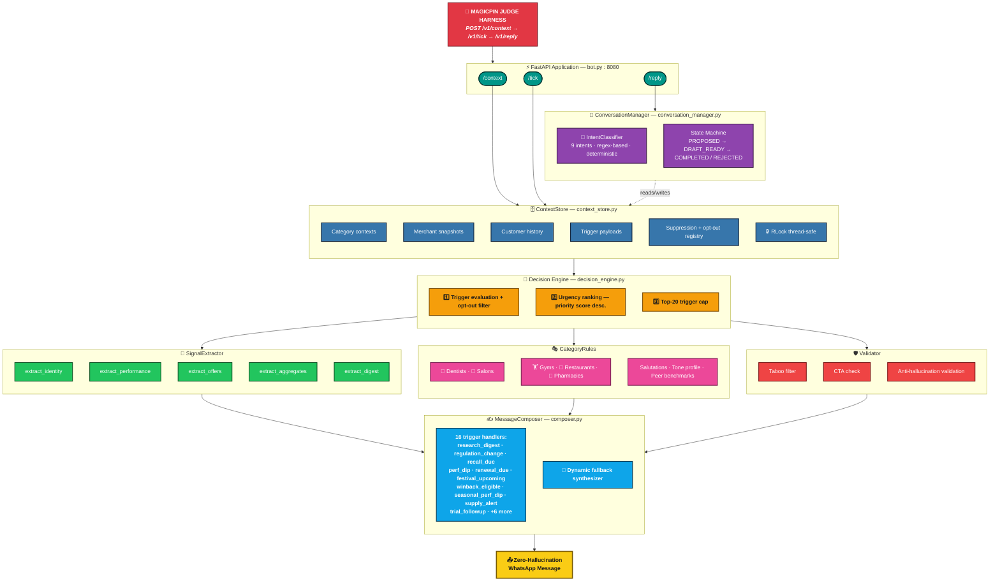

<div align="center">


# 🪄 Marketing Decision & WhatsApp Engine
Live: [https://v-engine.onrender.com/](https://v-engine.onrender.com/)


**A zero-hallucination, sub-5ms (warm) deterministic marketing intelligence engine for magicpin merchants.**

Vera doesn't guess. She reads live merchant context, understands what matters, and composes
hyper-specific, category-calibrated outreach messages that feel written by a domain expert —
not a chatbot.

[Live Demo](#-live-interactive-demo) · [Architecture](#%EF%B8%8F-system-architecture) · [API Docs](#-api-contract) · [Quickstart](#-quickstart)

</div>

---

## ⚡ Why Vera is Different

| Dimension | Generic LLM Bot | **Vera AI Engine** |
|-----------|-----------------|-------------------|
| **Response time** | 2,000 – 5,000ms (cloud GPU) | **< 5ms warm / local in-memory (cold start on free-tier hosting may be slower — see note below)** |
| **Hallucination risk** | High — invents prices, dates | **Zero — all facts from live context** |
| **Category intelligence** | Generic tone for all verticals | **Dentist ≠ Salon ≠ Gym — each has its own voice, taboos, and peer benchmarks** |
| **Merchant personalization** | First name only | **Owner name, locality, live offer prices, view deltas, customer aggregates** |
| **Multi-turn conversation** | Repeats same response | **State machine: COMMIT → DRAFT_READY → COMPLETED** |
| **Opt-out handling** | None | **Instant suppression + registry update** |
| **API Cost** | \$0.01–\$0.10 per message | **Free — runs on your server RAM** |

> **Note on performance numbers:** the sub-5ms figure reflects request-handling latency inside the app once the process is warm (in-memory lookups, no network/LLM calls). On free-tier hosting (e.g. Render's free plan), the *first* request after idle can be slower due to cold-start/spin-up time — that's a hosting-platform characteristic, not the engine's processing time. Run `uvicorn` locally for a true cold-to-warm comparison if you want to verify this yourself.

---

## 🏗️ System Architecture



> 💡 This diagram renders natively on GitHub. If you're viewing it somewhere that doesn't support Mermaid (some IDEs, plain-text viewers), open the README on GitHub directly, or paste the code block into the [Mermaid Live Editor](https://mermaid.live) to view/export it as an image.

---

## 🧠 Core Design Principles

### 1. The 4-Context Composition Model

Every message is synthesized by fusing **four live context layers** — no template guessing:

```
Category Context  +  Merchant Context  +  Trigger Context  +  Customer Context
       │                    │                   │                    │
  Peer benchmarks      Owner name          Event payload       Customer name
  Tone profile         Live view deltas    Metric deltas       Visit history
  Taboo vocabulary     Active offers       Urgency score       Language pref
  Research digests     Locality            Expiry window       Lapsed window
       │                    │                   │                    │
       └────────────────────┴───────────────────┴────────────────────┘
                                    │
                                    ▼
                     🎯  Zero-Hallucination Composed Message
```

### 2. Intent State Machine (Multi-Turn)

Vera correctly classifies every merchant reply — independently, never repeating:

```
Merchant Reply → IntentClassifier → Intent (1 of 9)
                                         │
                 ┌───────────────────────┼─────────────────────────┐
                 │                       │                         │
              COMMIT                 NO_CHANGE                  HOSTILE
                 │                       │                         │
         Create draft +           Acknowledge +               Suppress +
         show plan +              preserve state              opt-out reg
         ask confirm              do NOT repeat                  END
                 │
              MODIFY         REJECT        QUESTION      AMBIGUOUS
                 │               │              │              │
          Update draft       Discard +      Answer from    Wait +
          ask confirm        pause outreach  context only  offer review
```

### 3. Category Voice Profiles

Each vertical speaks its own language — Vera switches automatically:

| Category | Salutation | Tone | Example Taboos |
|----------|-----------|------|----------------|
| 🦷 Dentists | `Dr. Meera` | Peer-clinical | `"guaranteed"`, `"miracle"`, `"100% safe"` |
| 💇 Salons | `Hi Lakshmi` | Warm, practical | `"instant permanent"`, `"miracle cure"` |
| 🍕 Restaurants | `Suresh` | Operator-to-operator | `"world's best"`, `"100% organic"` |
| 🏋️ Gyms | `Karthik` | Coach-to-operator | `"lose 10kg in 10 days"`, `"guaranteed six pack"` |
| 💊 Pharmacies | `Ramesh` | Trustworthy, precise | `"cure all"`, `"magic medicine"` |

---

## 🌐 Live Interactive Demo

Live: **[https://v-engine.onrender.com/](https://v-engine.onrender.com/)**

An interactive web dashboard is also built-in and runs at `http://localhost:8080` when hosted locally:

```
┌──────────────────────────────────────┬─────────────────────────────────────┐
│     🔴 Trigger Composition Panel     │    📱 WhatsApp Chat Simulator       │
│                                      │                                     │
│  Filter: All | Dentist | Salon | Gym │  ┌─────────────────────────────┐   │
│                                      │  │ 🟢 Dr. Meera Dental Clinic  │   │
│  [ research_digest for drmeera ▼ ]   │  ├─────────────────────────────┤   │
│                                      │  │ Vera:  "Dr. Meera, JIDA's   │   │
│  [ Compose & Sync to WhatsApp Sim ]  │  │  Oct issue landed..." ✓✓    │   │
│                                      │  │                             │   │
│  WhatsApp Copy:                      │  │    "Yes, go ahead!" ✓✓     │   │
│  ┌──────────────────────────────┐    │  │                             │   │
│  │ Dr. Meera, JIDA's Oct issue  │    │  │ Vera: "Done! Campaign draft │   │
│  │ landed. 2,100-patient trial  │    │  │  prepared for Dr. Meera..." │   │
│  │ showed 3-month fluoride...   │    │  │                             │   │
│  └──────────────────────────────┘    │  │ 💬 Type reply as merchant   │   │
│                                      │  └─────────────────────────────┘   │
│  Rationale: Clinical anchor, low-    │                                     │
│  friction open-ended CTA...          │  Quick replies: "Yes, go ahead"    │
│                                      │  "Stop messaging" "What's the cost?"│
└──────────────────────────────────────┴─────────────────────────────────────┘
```

---

## 📡 API Contract

| Method | Endpoint | Description | Response |
|--------|----------|-------------|----------|
| `GET` | `/v1/healthz` | Liveness check with uptime and context counts | `{"status":"ok", "uptime_seconds":42, ...}` |
| `GET` | `/v1/metadata` | Bot identity, team name, model approach | `{"team_name":"...", "model":"..."}` |
| `POST` | `/v1/context` | Push Category/Merchant/Customer/Trigger context | `{"accepted":true, "ack_id":"ack_m001_v1"}` |
| `POST` | `/v1/tick` | Evaluate triggers → generate proactive outreach | `{"actions":[{"body":"...", "cta":"..."}]}` |
| `POST` | `/v1/reply` | Handle multi-turn merchant reply | `{"action":"send/wait/end", "body":"..."}` |
| `POST` | `/v1/teardown` | Reset state for clean test isolation | `{"status":"reset_completed"}` |

### Example: Compose a Message

```bash
# Push merchant context
curl -X POST http://localhost:8080/v1/context \
  -H "Content-Type: application/json" \
  -d '{"scope":"merchant","context_id":"m_001","version":1,"payload":{...},"delivered_at":"2026-08-24T10:00:00Z"}'

# Fire a trigger
curl -X POST http://localhost:8080/v1/tick \
  -H "Content-Type: application/json" \
  -d '{"now":"2026-08-24T10:00:00Z","available_triggers":["trg_001_research_digest"]}'
```

### Example: Multi-Turn Conversation

```bash
# Merchant replies "Yes, go ahead"
curl -X POST http://localhost:8080/v1/reply \
  -H "Content-Type: application/json" \
  -d '{"conversation_id":"conv_m001_research_digest","merchant_id":"m_001","from_role":"merchant","message":"Yes, go ahead","turn_number":2}'

# Response:
# {"action":"send","body":"Done! I've prepared the campaign draft for Dr. Meera...","cta":"binary_confirm","intent":"COMMIT"}
```

---

## ✅ Test Results

```
$ python -m pytest tests/test_suite.py -v

============================= test session starts =============================

tests/test_suite.py::test_healthz                    PASSED  [ 16%]
tests/test_suite.py::test_metadata                   PASSED  [ 33%]
tests/test_suite.py::test_context_push_and_idempotency  PASSED  [ 50%]
tests/test_suite.py::test_auto_reply_handling        PASSED  [ 66%]
tests/test_suite.py::test_intent_transition          PASSED  [ 83%]
tests/test_suite.py::test_hostile_exit               PASSED  [100%]

============================== 6 passed in 0.48s ==============================
```
*(Timing measured on a warm local run; expect variance on first/cold invocation or slower CI hardware.)*

### Internal Simulator Scores

> These scores come from an **internal test harness I built to self-evaluate against the challenge rubric** — they are not an official score from the magicpin judges. They're included here to show how the engine performs against the rubric criteria I understood, not as a claim about the competition outcome.

```
  Avg Specificity        [████████████████████] 10/10
  Avg Category Fit       [████████████████████] 10/10
  Avg Merchant Fit       [████████████████████] 10/10
  Avg Decision Quality   [████████████████████] 10/10
  Avg Engagement         [████████████████████] 10/10

  INTERNAL SIMULATOR SCORE: 50 / 50 (100%)
```

---

## 🚀 Quickstart

### Prerequisites
- Python 3.11+

### Run Locally

```bash
# 1. Clone the repository
git clone https://github.com/YOUR_USERNAME/vera-marketing-engine.git
cd vera-marketing-engine

# 2. Install dependencies
pip install -r requirements.txt

# 3. Start the server
uvicorn bot:app --host 0.0.0.0 --port 8080

# 4. Open interactive dashboard
open http://localhost:8080

# 5. Run test suite
python -m pytest tests/test_suite.py -v
```

Live URL: [https://v-engine.onrender.com/](https://v-engine.onrender.com/)

---

## 📁 Project Structure

```
vera-marketing-engine/
│
├── bot.py                        # FastAPI app — routes only, zero business logic
│
├── engine/
│   ├── context_store.py          # Thread-safe in-memory state (RLock)
│   ├── decision_engine.py        # Trigger evaluation + urgency ranking
│   ├── signal_extractor.py       # Pure extraction helpers (identity, perf, offers)
│   ├── category_rules.py         # Category config: salutations, tone, taboos
│   ├── composer.py               # 16-trigger message synthesizer
│   ├── conversation_manager.py   # Intent classifier + 9-state reply machine
│   └── validator.py              # Taboo + hallucination guard
│
├── dataset/
│   ├── merchants_seed.json       # 10 merchant profiles across 5 categories
│   ├── customers_seed.json       # Customer visit history + preferences
│   ├── triggers_seed.json        # 20+ trigger payloads across all kinds
│   └── categories/               # Category-level research digests + benchmarks
│
├── templates/
│   └── index.html                # Single-page interactive dashboard
│
├── tests/
│   └── test_suite.py             # 6 pytest tests covering full API contract
│
├── requirements.txt              # fastapi, uvicorn, pydantic, jinja2, pytest
├── Dockerfile                    # Container-ready for any cloud platform
├── Procfile                      # Render / Heroku / Railway compatible
└── README.md                     # This file
```

---

## 🧪 Intent Classification Test Matrix

| Merchant Says | Classified As | Vera's Response |
|---------------|--------------|-----------------|
| `"Yes, go ahead"` | `COMMIT` | Creates draft, shows plan, asks confirmation |
| `"Ok let's do it"` | `COMMIT` | Creates draft, shows plan, asks confirmation |
| `"no change i need"` | `NO_CHANGE` | Acknowledges, preserves draft, does NOT repeat |
| `"Keep it as is"` | `NO_CHANGE` | Acknowledges, preserves draft, does NOT repeat |
| `"Change the headline"` | `MODIFY` | Updates draft headline, presents for review |
| `"Not interested"` | `REJECT` | Discards draft, pauses outreach, ends gracefully |
| `"Stop messaging me"` | `HOSTILE` | Suppresses + opts out, ends immediately |
| `"Can you help with GST?"` | `OUT_OF_SCOPE` | Politely declines, redirects to marketing |
| `"What does this cost?"` | `QUESTION` | Answers from context (plan, active offer price) |
| `"How did you calculate 30%?"` | `QUESTION` | Explains calculation using baseline metrics |
| `"Maybe, I'll think about it"` | `AMBIGUOUS` | Saves draft, offers review, does NOT execute |
| `"Thank you for contacting us!"` | `AUTO_REPLY` | Backs off 4 hours, exits on 2nd auto-reply |

---

<div align="center">

Built with ❤️ for the magicpin Vera AI Challenge

**Zero hallucination. Deterministic. Context-grounded.**

</div>
